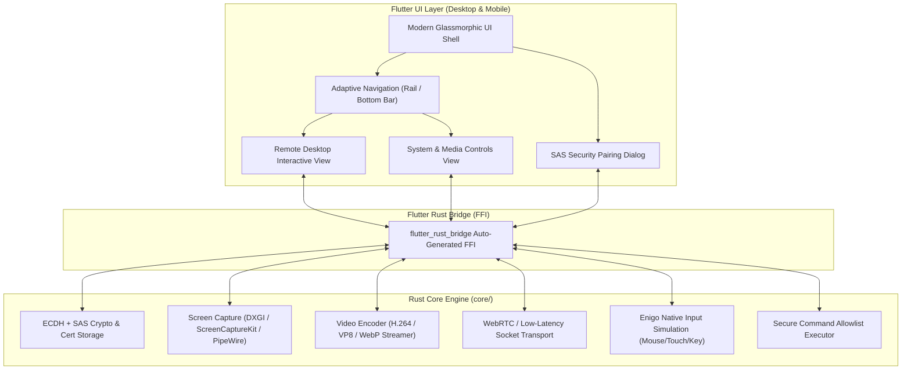
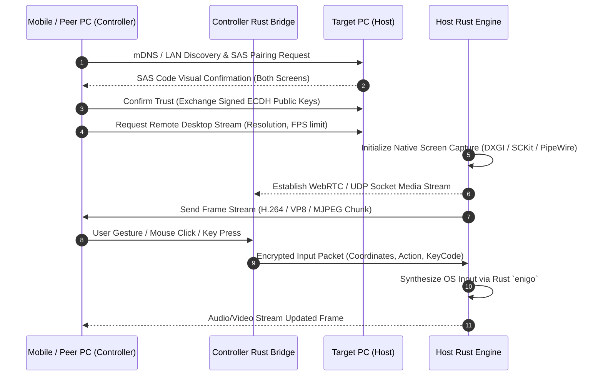

# ShanuSend: UI/UX Modernization, System Controls & Remote Desktop Implementation Plan

## 📌 Executive Summary

**ShanuSend** is evolving into a unified cross-platform hub for file sharing, phone linking, system control, screen mirroring, and **Remote Desktop control** (Mobile-to-PC and PC-to-PC).

This plan outlines the end-to-end architecture, UI/UX redesign, system control enhancements, and low-latency Remote Desktop engine required to transform ShanuSend into a production-grade application.

---

## 🏗️ Architecture & High-Level Design

---

## 🎨 1. UI & UX Revamp Specification

### 1.1 Visual Language & Theme System
* **Glassmorphism & Micro-Interactions**: Translucent surfaces (`BackdropFilter` with `ui.ImageFilter.blur`), subtle neon accent borders, soft shadows, elevation layers.
* **Curated Palette**:
  - **Dark Glass (Default)**: Deep obsidian background (`#0B0F19`), frosted glass cards (`rgba(255, 255, 255, 0.05)`), vivid cyan/violet gradient accents (`#00F2FE` to `#4FACFE`).
  - **Light Glass**: Soft porcelain background (`#F4F7FB`), clean glass overlay (`rgba(255, 255, 255, 0.7)`), deep indigo accents (`#4F46E5`).
  - **OLED Black**: True black background (`#000000`), high-contrast accent highlights.
* **Modern Typography**: Clean sans-serif hierarchy (Inter / Outfit / Roboto), crisp data labels, dynamic font sizing.

### 1.2 Adaptive Navigation Shell
* **Desktop Layout (> 720dp)**: Custom frameless window titlebar (`bitsdojo_window` / `window_manager`), left vertical Navigation Rail with collapsible labels, System Tray integration (`tray_manager`), drag-and-drop target zone (`desktop_drop`).
* **Mobile Layout (< 720dp)**: Bottom Navigation Bar with haptic feedback, swipeable tab views, pull-to-refresh device discovery, bottom sheet controls.

### 1.3 Remote Desktop Touch & Mouse Interface
* **Mobile Virtual Trackpad Mode**:
  - Direct 1:1 absolute touch mapping OR relative trackpad drag mode.
  - Multi-touch gestures: 2-finger scroll, 2-finger pinch zoom, 2-finger right click, 3-finger app switcher.
  - On-screen touch overlay: Virtual joystick, left/right mouse click buttons, scroll wheel strip.
  - Floating Control Bar: Toggle Virtual Keyboard, Alt+Tab, Ctrl+Alt+Del, Win key, Screen Scaling mode, Display selector.
* **PC-to-PC Remote View Window**:
  - Fullscreen / Fit-to-Screen / 100% Native Resolution toggle.
  - Direct mouse pass-through with cursor shape synchronization.
  - Keyboard shortcut passthrough (capture OS keys when window is focused).
  - Multi-monitor switcher toolbar.

---

## 🖥️ 2. Remote Desktop Feature (Mobile-to-PC & PC-to-PC)

### 2.1 Remote Desktop System Flow

### 2.2 Screen Capture & Encoding Engine
* **Windows Host**: DXGI Desktop Duplication API (DirectX / GPU acceleration for 60 FPS capture with minimal CPU load).
* **macOS Host**: `ScreenCaptureKit` (macOS 12.3+) / `AVFoundation`.
* **Linux Host**: `PipeWire` (Wayland) / `XShm` (X11).
* **Video Pipeline**: Frame capture -> Color space conversion (NV12 / YUV420p) -> Hardware/Software H.264 or VP8 encoder -> Chunk packager.
* **Adaptive Bitrate**: Dynamic resolution & frame rate scaling (30 FPS to 60 FPS, 720p to 1080p to 4K) based on network round-trip latency.

### 2.3 Input Simulation & Remote Control
* **Rust `enigo` Input Dispatcher**:
  - Mouse movement (Absolute & Relative coordinates).
  - Mouse buttons (Left, Right, Middle, Drag).
  - Scroll wheel (Vertical & Horizontal deltas).
  - Keyboard events (Unicode text typing, Special Keys: Esc, Tab, Enter, Backspace, Arrows, F1-F12).
  - Key combinations (Ctrl+C, Ctrl+V, Alt+Tab, Win+D, Ctrl+Alt+Del).
* **Latency Optimization**: Sub-30ms input-to-display loop over local Wi-Fi.

---

## ⚡ 3. System & Control Suite Enhancements

### 3.1 Extended System Commands & Allowlist
* **Power Management**: Shutdown, Restart, Sleep, Hibernate, Lock Screen, Display Off.
* **Media & Volume Control**: Master Volume Slider, Mute/Unmute, Play/Pause, Next/Previous Track, Media App Launcher.
* **System Metrics Monitor**: Real-time CPU Usage, RAM Usage, Battery Percentage, Network Speed streamed to mobile remote.
* **Secure Allowlist**: Configurable XML/JSON allowlist on PC specifying allowed executables and shell commands to prevent unauthorized remote code execution.

### 3.2 Cryptographic SAS Pairing & Trust Persistence
* **ECDH Key Exchange**: Generate ephemeral Curve25519 keypair during pairing.
* **Short Authentication String (SAS)**: Compute 6-digit numeric hash shown simultaneously on Host and Remote.
* **Persistent Trust Store**: Store encrypted peer ID, public key, and friendly name in platform secure storage (`flutter_secure_storage`).
* **Packet Authentication**: All control packets signed with session token and validated against trust store before execution.

---

## 📅 4. Phased Implementation Roadmap

### Phase 1: Rust Core Bridge & Cryptographic Foundation
- [ ] Add `flutter_rust_bridge` to `flutter_app/pubspec.yaml` and `core/Cargo.toml`.
- [ ] Expose `core::crypto` FFI bindings for Curve25519 ECDH key generation, fingerprinting, and SAS code derivation.
- [ ] Implement secure device trust persistence (`trusted_device_store.dart` linked to Rust crypto).
- [ ] Enable TLS transport by default on LocalSend & ShanuConnect sockets.

### Phase 2: UI & UX Modernization
- [ ] Implement Glassmorphic Design System (`AppTheme`, blur effects, gradients, color tokens).
- [ ] Build Adaptive Responsive Navigation Shell (Desktop Navigation Rail vs Mobile Bottom Bar).
- [ ] Implement Custom Titlebar (`bitsdojo_window` / `window_manager`) & System Tray (`tray_manager`).
- [ ] Add drag-and-drop file receiver zone for desktop (`desktop_drop`).
- [ ] Redesign Device Discovery Grid with circular status avatars, signal strength, and pairing status indicators.

### Phase 3: System & Input Control Engine
- [ ] Bridge `core::shanuconnect` and `core::remote_input` (`enigo`) to Flutter via FFI.
- [ ] Implement bidirectional System Metrics & Media Control sync (Volume, Mute, Playback, Power).
- [ ] Build Command Allowlist Manager UI on desktop with pre-configured safe quick actions.
- [ ] Implement Virtual Trackpad UI with 2-finger scroll, pinch-zoom, and on-screen gesture control on mobile.

### Phase 4: Remote Desktop Capture & Streaming Engine
- [ ] Implement native screen capture module in Rust (`DXGI` on Windows, `ScreenCaptureKit` on macOS, `PipeWire`/`XShm` on Linux).
- [ ] Integrate H.264 / VP8 frame encoder & WebRTC / low-latency UDP socket transport in Rust.
- [ ] Create Remote Desktop signaling protocol over ShanuConnect LAN channel.
- [ ] Implement adaptive bitrate/framerate dynamic scaling based on network conditions.

### Phase 5: Interactive Remote Desktop Client Views
- [ ] Build Mobile Remote Desktop Viewer (`remote_desktop_view.dart`) with pan/zoom, virtual joystick overlay, and floating toolbar.
- [ ] Build PC-to-PC Remote Desktop Viewer with fullscreen mode, resolution scaling, multi-monitor switcher, and keyboard hook capture.
- [ ] Implement Remote Keyboard drawer with modifier keys (Ctrl, Alt, Shift, Win, Fn, Esc, Tab).
- [ ] Integrate remote cursor shape synchronization (default, pointer, text beam, resize).

### Phase 6: Scrcpy / ADB Tool Bootstrapper & Mirroring Polish
- [ ] Implement `ToolBootstrapService` to auto-download, checksum-verify, and cache `adb` and `scrcpy` binaries on Windows, macOS, and Linux.
- [ ] Implement real `adb devices -l` polling and Wireless ADB pairing UI flow.
- [ ] Surface scrcpy runtime output and errors in an in-app diagnostic console.

### Phase 7: Verification, QA & Continuous Integration
- [ ] Write unit tests for Rust crypto, pairing, input simulation, and protocol encoding.
- [ ] Write Flutter widget & integration tests for navigation, pairing dialogs, and remote views.
- [ ] Configure GitHub Actions CI build matrix verifying Windows, macOS, Linux, and Android builds.

---

## 🛠️ 5. Task & Module Matrix

| Component | Target File / Path | Key Responsibility |
| :--- | :--- | :--- |
| **Rust Bridge** | `core/src/ffi.rs` | Expose Rust crypto, capture, stream, and input methods to Dart |
| **Theme Engine** | `flutter_app/lib/theme/app_theme.dart` | Glassmorphic design tokens, dark/light/OLED themes |
| **Adaptive Shell** | `flutter_app/lib/views/home_view.dart` | Responsive navigation, Titlebar, System Tray, Drag-and-Drop |
| **SAS Pairing UI** | `flutter_app/lib/widgets/pairing_dialog.dart` | Mutual 6-digit SAS code display & confirmation dialog |
| **Remote Desktop Engine** | `core/src/remote_desktop/` | Native screen capture, H.264 encoder, UDP/WebRTC transport |
| **Mobile Remote View** | `flutter_app/lib/views/remote_desktop_view.dart` | Interactive screen viewer, touch gestures, overlay toolbar |
| **Input Dispatcher** | `core/src/remote_input.rs` | `enigo`-backed mouse/keyboard injection |
| **System Control** | `flutter_app/lib/views/shanu_connect_view.dart` | Media sync, volume sliders, allowlist command triggers |
| **Scrcpy Bootstrapper**| `flutter_app/lib/services/tool_bootstrap_service.dart` | Auto-download, SHA-256 verification, and adb/scrcpy execution |

---

## 🧪 6. Verification Protocol

1. **Architecture & Security Verification**:
   - Verify `flutter_rust_bridge` compiles clean on Windows (`cargo check` & `flutter run`).
   - Test SAS pairing: Verify untrusted device packets are rejected until mutual SAS code confirmation succeeds.

2. **UI & UX Verification**:
   - Verify Glassmorphic theme switching dynamically without app restart.
   - Verify window resizing transitions smoothly from Mobile Bottom Bar to Desktop Nav Rail.

3. **Remote Desktop & Input Verification**:
   - Test Mobile-to-PC Remote Desktop: Connect Android/iOS app to Windows PC over LAN, verify video stream (>30 FPS) and touch-to-click response time (<30ms).
   - Test PC-to-PC Remote Desktop: Connect Windows PC to another PC, verify fullscreen view, multi-monitor switching, and full keyboard passthrough.
   - Test Virtual Trackpad & Gestures: Verify 2-finger scroll and right-click tap work smoothly.

4. **System Control Verification**:
   - Test master volume slider, mute, lock screen, and pre-configured allowlist commands.
